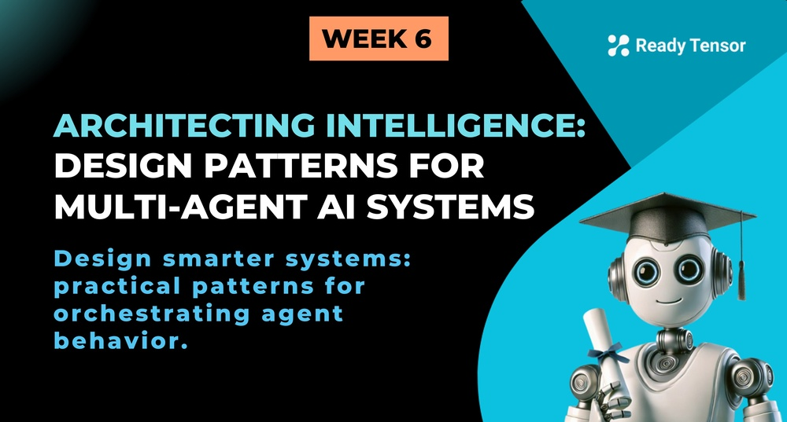
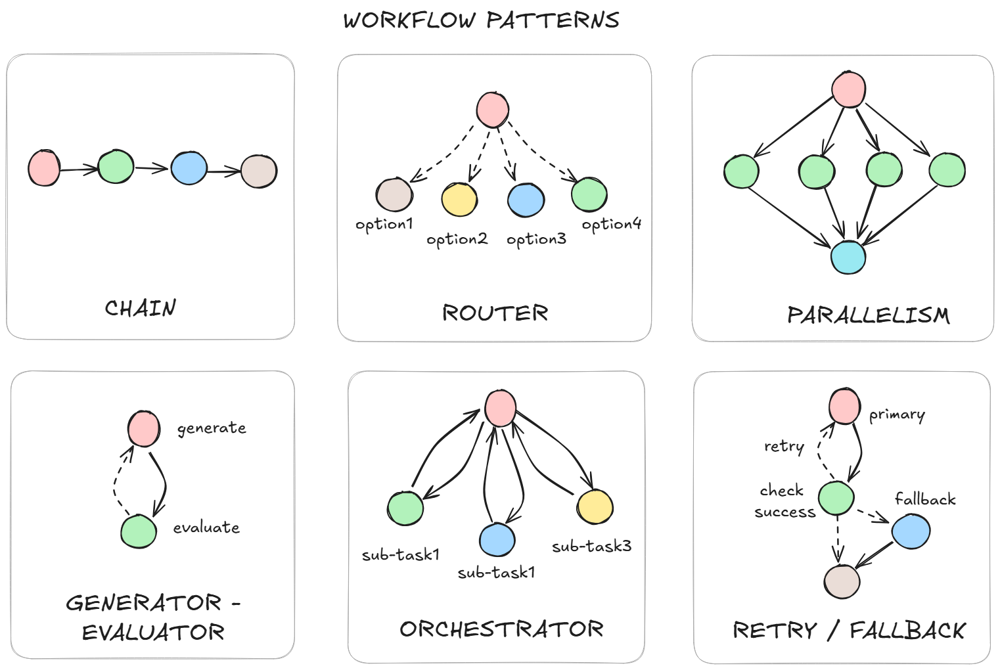
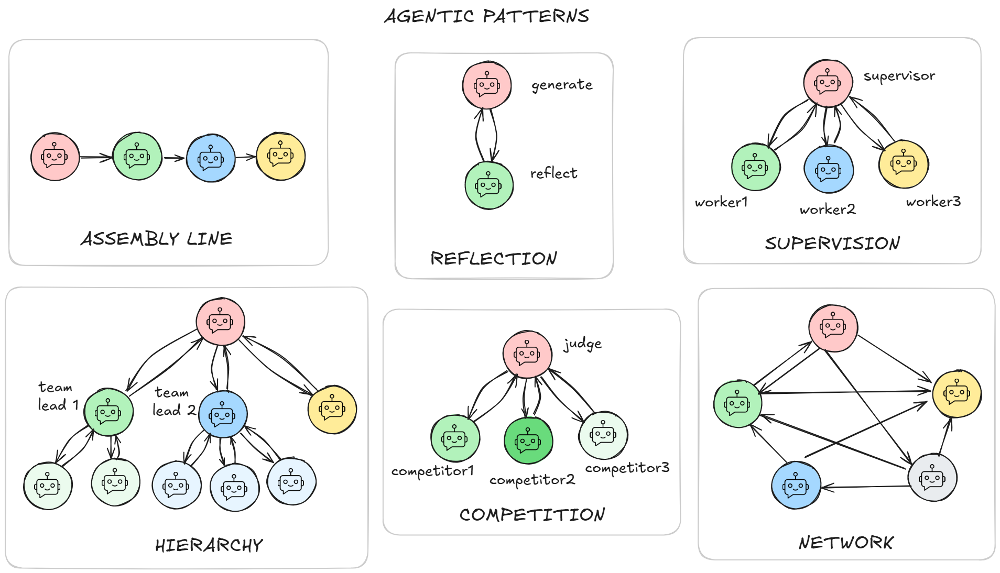

--DIVIDER--

# TL;DR

Not every problem needs a team of agents—but when complexity demands specialization, multi-agent systems shine. In this lesson, you'll learn key building blocks, common multi-agent architectures, and the pitfalls to avoid when designing collaborative AI systems.

---

--DIVIDER--

# This Is Not Improv: Multi-Agent Systems Need Blueprints 📐

In the early days of deep learning, we used to see posts like this:

> _“Look at this neural network I built! It has 300 million trainable parameters. It's beautiful!”_

Today, in the age of agentic AI, there’s a new kind of brag:

> _“Check out this system I built! It has 20 agents working together, using over 100 tools. It's beautiful!”_

But here’s the question we _should_ be asking more often:

> **Did you need that much complexity?** > **Did you try something simpler first?** > **How did you decide on that architecture?**

Just like in ML, **more is not always better**. The ability to spin up a fleet of agents with frameworks such as CrewAI or LangGraph in just a few lines of code is empowering — but also dangerously tempting. Without thoughtful design, you end up with systems that are:

- ❌ **Slow** — every agent and tool call adds latency
- 💸 **Expensive** — costs add up as systems get more complex
- 🧩 **Unreliable** — more moving parts = more failure points
- 🤯 **Hard to debug** — especially when agents depend on each other’s outputs
- 🌀 **Loop-prone** — agents get stuck checking each other’s work, endlessly

Just because you _can_ add another agent doesn’t mean you _should_.

So, this week is how to **design, not demos** — **discipline, not vibes**.

---

--DIVIDER--

# 🧱 Building Blocks of Agentic Systems

To design agentic systems systematically, you need to think in three levels of abstraction:

1.  **Primitives** – the atomic units: LLM calls, memory, tools, and conditional branch
2.  **Workflow Patterns** – how primitives are composed: sequences, routers, parallel calls, orchestrators, and more
3.  **Agentic Patterns** – how multiple workflows interact: supervisor, hierarchical, reflective, and other multi-agent designs

This layered approach helps you reason clearly about design choices — and avoid spaghetti systems that are hard to debug, slow to run, and painful to evolve.

Let’s walk through each layer.

---

--DIVIDER--

## Primitives: The Building Blocks of Agentic Systems

Let's start with the foundational units — the **primitives** you'll use to construct graphs and design agentic behavior.

These are the core elements that make up nearly every system, no matter how complex:

### 🔹 Logic Node

This is where the system processes information — either through LLM reasoning or programmatic logic. Logic nodes process input and emit output, and can be used for tasks like reasoning, planning, computing, summarizing, and more.

> Example: An LLM that answers a user question. A Python function that validates schema. A scoring heuristic.

### ➡️ Edge: Connection Between Nodes

A connection between nodes that defines flow and data transfer. Edges can be simple (always execute) or conditional (execute based on state or logic). They determine both the sequence of operations and what information passes between nodes.

> Example: A fixed link from "input" to "processor." A conditional edge that routes to different nodes based on task type.

### 🛠️ Tool

A callable interface to external functionality. Tools are how agents interact with the world — from querying databases to calling APIs or running code. They may have side effects or return structured information.
:::info{title="Info"}
Tools are usually called by nodes, though in LangGraph they may be wrapped and represented as nodes themselves.
:::

> Example: A search engine wrapper, a calculator, a code execution function.

### 💾 Memory

A storage unit for context — persistent across steps or sessions. Memory lets your system "remember" prior inputs, outputs, or decisions, and use them to inform future steps. In most cases, memory is injected into logic nodes via prompt augmentation.

> Example: A conversation history store, a task scratchpad, or a persistent knowledge base.

---

--DIVIDER--

## Workflow Patterns: The “Cells” of Agentic Systems

If primitives are the molecules, **workflow patterns are the cells** — functional units built from those pieces, each designed to solve a specific kind of problem.

Just like biology has muscle cells for motion, neurons for signaling, and immune cells for defense, agentic systems rely on reusable structures that solve different types of tasks. Learn these, and you’ll start spotting them everywhere.

Let’s walk through the foundational patterns you’ll use again and again:

---

--DIVIDER--

--DIVIDER--

### 🔗 Chain (Sequential)

The simplest pattern: a straight line. One thing happens, then the next.

Chains are perfect for tasks with a fixed order — preprocess → act → tidy up. Our publication pipeline works this way: extract metadata → summarize content → generate tags → format output.

They’re easy to debug and reason about. But brittle — if one step fails, everything downstream breaks.

---

### 🔀 Router

A router adds decision-making. It inspects the input and chooses the next step.

This is where agentic behavior starts to emerge — the system isn’t just following instructions, it’s making choices.

> At Ready Tensor, we use a router to triage publications: research papers go through expert review, student projects go to peer review, and applied solutions follow a separate track.

---

### ☰ Parallelism

Not all tasks need to happen in sequence. If they’re independent, run them in parallel.

This saves time and brings in multiple perspectives. But it also means reconciling outputs — which can get messy if the results conflict.

:::info{title="Parallelism for Map-Reduce"}
⚠️ Note: This pattern is ideal for map-reduce style operations — where you apply the same logic across many inputs (map) and then combine the outputs (reduce).
:::

> In our evaluation engine, 100+ assessment criteria are computed independently in parallel. Once done, the results are merged into a single scorecard.

---

### 🎭 Generator–Evaluator Loop

One node creates, another critiques. The result improves over time.

It’s a powerful pattern — summaries, plans, reference lists, and more can all benefit from refinement. But it needs clear exit conditions to avoid infinite loops.

> In our authoring assistant, the generator proposes a list of references based on the content. The evaluator checks for accuracy. If it's not good enough, the generator tries again — up to three times.

---

### 🎯 Orchestrator

When the task is too complex or dynamic for a chain or router, it’s time to orchestrate.

The orchestrator decomposes the task, assigns subtasks to the right workflows, and coordinates the results. It can plan, reason, and adapt — using techniques like chain-of-thought or self-ask to break problems down.

> At Ready Tensor, we use orchestrators to coordinate publication evaluation and authoring. They decide which agents to call, what sequence to follow, and how to assemble the final output.

---

### 🔁 Retry / Fallback

When things go wrong, don’t crash — try again or try something else.

This pattern adds robustness. A node retries if it fails, or falls back to an alternate method. It’s simple to implement but dramatically improves reliability.

---

--DIVIDER--

## 🧠 Agentic Patterns: Collaboration at the System Level

Workflow patterns define how a few nodes combine into _functional units_. **Agentic patterns** define how those units combine into _larger, more capable systems_.

These are your high-level coordination and collaboration strategies — architectural blueprints for behavior once you move beyond single-agent setups.

Let’s walk through core patterns:

--DIVIDER--

--DIVIDER--

### 🏭 Assembly Line

A chain of agents, each handling a distinct part of the task. Like a factory line, work is passed from one agent to the next.

This pattern mirrors the **Chain** workflow — but here, each step is handled by a full-fledged agent (or even a workflow cell). That means each stage can involve its own reasoning, tools, or even subroutines.

> Example: A content pipeline with agents for research → drafting → editing → fact-checking → formatting.

It’s modular and easy to reason about — ideal for **structured**, **repeatable**, and **multi-step** processes. But there’s a catch: errors compound as they move downstream. If the output is wrong at the end, tracing it back can be tough.

---

### 🪞 Reflection

This mirrors the **generator–evaluator** workflow — but at the agentic level.

Here, one agent generates a response, and another agent evaluates it. Based on feedback, the generator may refine its output. The key difference is that these aren’t just function nodes — they can be full agents, possibly running their own internal workflows or logic.

Used for: improving quality and correcting reasoning errors.

---

### 🧑‍🏫 Supervisor

One agent oversees the work of others — assigning tasks, checking outputs, or deciding when to intervene.

Supervisors are useful for **delegation**, **quality control**, and **system-level decision-making**.

This mirrors the orchestration workflow pattern — but instead of static logic, a dynamic agent decides what to do, when, and with whom.

> The supervisor doesn’t just call nodes; it reasons about the task and manages specialized agents. Each agent it supervises might itself run a full workflow — like a chain or generator–evaluator loop — making this a higher-order composition of agents and workflows.

---

### 🪜 Hierarchical

Agents are arranged in a hierarchy — with higher-level agents breaking down tasks and lower-level agents executing them.

This is an extension of the supervisor pattern, but with multiple levels of delegation. Each layer manages the one below, forming a cascading structure of control and execution.

This mirrors organizational structures in human teams. It’s ideal when tasks can be decomposed cleanly, and subtasks can be handled independently.

> For example, a project manager agent might delegate to team lead agents for writing, data analysis, and design — and each of those might in turn manage specialist agents (e.g., a graph creator, a fact-checker, or a code explainer).

Hierarchies help manage complexity through abstraction and role separation, but they also introduce challenges like coordination overhead, latency, and error propagation across levels.

---

### 🥊 Competitive Pattern

Multiple agents tackle the same task independently — and the system selects or synthesizes the best result.

This encourages **diversity of thought**, often leading to more robust or creative solutions. Agents may differ in prompting strategies, tools used, or model types. The outputs can then be judged by a scoring function, a critique agent, or even a voting mechanism.

> Popular in tasks like summarization, code generation, planning — where there's no single “right” answer.

The final output might come from a **winner-takes-all** selection, a **consensus vote**, or a **blended response** — echoing the “**wisdom of the crowd**” principle.

While powerful, this pattern increases compute usage and evaluation complexity. Use it when the value of better results outweighs the cost.

---

### 🌐 Network

Agents operate in a loose, decentralized network — communicating with each other, sometimes recursively, to achieve a shared goal.

There’s no fixed hierarchy. Instead, coordination emerges from the interactions themselves.

> This pattern is powerful for brainstorming, consensus-building, or solving problems with no clear linear flow.

But it’s also the hardest to debug — feedback loops, message passing, and unclear boundaries can lead to emergent behaviors (both good and bad). This pattern isn't used that often in production systems.

---

--DIVIDER--

## 🧩 Real-World Systems Combine Patterns

Most production-grade agentic systems don’t use a single pattern. Instead, they combine several — sometimes within the same workflow.

A reflective agent might operate inside a hierarchical system. A supervisor might choose between competing outputs. A network of agents might contain internal chains or routers.

That’s the art of agentic system design: **knowing the patterns**, understanding their strengths and limitations, and combining them thoughtfully to match the task.

Simple systems work better when they’re _simple on purpose_ — and complex systems work best when they’re **composed from understandable parts**.

---

--DIVIDER--

## ⚠️ Antipatterns to Avoid

Even with great patterns, things can go wrong. These common pitfalls lead to brittle, inefficient, or confusing agentic systems:

--DIVIDER--

### 🧰 One Agent to Rule Them All

Designing a single agent to handle everything.
This creates a **Swiss Army Knife Agent** — overloaded and underperforming. It lacks clarity, makes debugging harder, and breaks down under pressure. Give each agent a clear, focused role. Think **Single Responsibility Principle**.

---

### 🧱 Death by a Thousand Agents

Designing one agent per tiny task.
This results in **agent bloat** — too many agents, each doing too little. It increases overhead, adds coordination complexity, and blurs accountability. Prefer fewer, more capable agents, and use **workflows (cells)** for internal steps. Apply the **KISS principle** - Keep It Simple, Stupid.

---

### 🧠 The LLM Hammer

Treating every node like an agent — even when it doesn’t need to be.

Not every task needs reasoning, reflection, or natural language understanding. Wrapping every step in an LLM adds latency, cost, and unpredictability. Some things are better handled with regular logic, deterministic code, or fast lookups.

**Examples:**

- Having an agent "decide" between two predetermined options when a simple if/else would work. This is the classic **LLM-as-Router Overkill** scenario.
- Using an LLM to parse structured data that could be handled with regex or a simple parser
- Prompting for arithmetic or other math operations ("What's 15% of $240?")
- Wrapping simple API calls (like updating a database record) in agent tools when direct function calls would work

> Just because you can prompt it, doesn’t mean you should.

---

### 🔗 The Chain of Pain

Designing overly lengthy sequence of agents that depend on each other.
This makes systems **fragile and slow**. If one step fails or drifts in quality, downstream outputs degrade — and you won’t know where it broke. Because everything runs in sequence, speed suffers too.

Instead, break chains into modular units with clear boundaries. Validate outputs between steps, test them independently, and parallelize where possible.

---

### 🤹 Blurred Boundaries

Assigning multiple agents vague or poorly defined roles.

This often leads to **conflicting actions, duplicated work, or contradictory outputs** — not because agents are faulty, but because their responsibilities aren’t clearly scoped. It’s one of the most common sources of confusion in multi-agent systems.

Avoid this by designing clear, non-overlapping roles. Define who acts, who verifies, and who decides — and ensure the handoffs are unambiguous.

> Good fences make good agents.

---

### 🕳️ Falling Through the Cracks

Leaving parts of the workflow undefined.

This causes the opposite problem as the one above: no agent or tool is responsible.

When no agent or tool owns a task, critical steps go unhandled. Apply the **MECE principle** — make responsibilities **mutually exclusive** (no overlap) and **collectively exhaustive** (no gaps).

---

### 🔁 No Escape Hatch

Designing loops with no cap, limit, or fail-safe.

This is one of the most common failure modes in agentic systems — nodes stuck in a loop without making progress. It often looks like thinking, but nothing gets done.

**Common causes include:**

- Output parsing failures that prevent state from advancing
- Tool or API errors that always trigger retries
- Mismatched responsibilities — e.g., an evaluator checks for criteria the generator never produces
- Loops without a cap — no confidence threshold, retry limit, or timeout

Every loop needs an **escape hatch**. Otherwise, your system might just spin forever.

---

--DIVIDER--

# ✅ Wrapping Up: Patterns Before Agents

Before we jump into building agents, it’s critical to understand **how they’ll interact** — and what workflows they’ll drive.

In this lesson, we covered:

- **Workflow Patterns (Cells):** Building blocks like chains, retries, forks, and orchestration — the logic that defines _how_ things get done.
- **Agentic Patterns:** Higher-level coordination strategies like supervision, reflection, or competition — the logic that defines _who_ does what.
- **Common Antipatterns:** Pitfalls like agent bloat, long chains, or infinite loops that make systems fragile or inefficient.

These patterns help you design systems that are **modular**, **adaptable**, and **maintainable** — whether you're using simple tools or building multi-agent ecosystems.

Next up, we’ll start assembling these pieces into actual agentic systems using **LangGraph**. But keep this principle in mind:

> **Every node in your graph is either a tool, an agent, or a cell.**
> And sometimes… it's all three.

You now have the vocabulary to design smart systems — not just smart agents.
