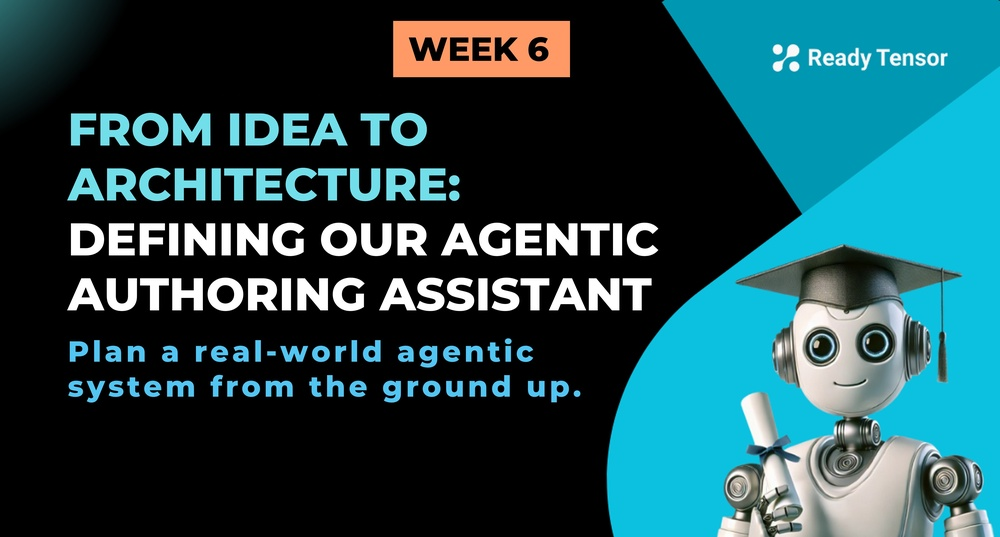

---

--DIVIDER--

# TL;DR

This lesson defines the Agentic Authoring Assistant (A3) project we'll be building: a system that helps authors generate metadata and supporting content for AI projects, including titles, tags, summaries, images, and references. We dive into the tag extraction subsystem as a design case study, exploring how to combine rule-based methods (gazetteer), ML models (NER), and LLM-based approaches. The key focus is on architectural decision-making: determining where agents add value versus where traditional tools and functions are more appropriate in real-world systems.

---

--DIVIDER--

# 🚀 From Patterns to Practice

In the last lesson, we explored the building blocks of agentic systems — workflow patterns, agent coordination strategies, and the common pitfalls to avoid. But knowing the patterns is only half the story.

The real challenge?
**Figuring out when and how to use them.**

Because your goal isn’t to make a system _agentic_ for its own sake.
Your goal is to **solve a problem** — and do it with an architecture that’s effective, efficient, and maintainable.

Sometimes that means using agents.
Sometimes it means calling a function, running a model, or just keeping it simple.

And that’s what this lesson is all about.

---

--DIVIDER--

# 🎯 Designing with Purpose

In this lesson, we introduce a real-world project that’s relevant, open-ended, and full of architectural tradeoffs. There’s no single right answer — but there are definitely better and worse ones.

You can always try different architectures and see what works — and in fact, next week we’ll talk about how to evaluate and compare them. But for now, your focus should be on **designing with intent**.

> **What’s the problem?** > **What’s the cleanest, smartest way to solve it?** > **Where do agents actually make sense?**

This is your chance to take what you’ve learned about agentic architectures and apply it to something practical. Something useful. And yes — something fun.

---

--DIVIDER--

# ✍️ The Project: An Agentic Authoring Assistant (A3) System

At Ready Tensor, we want the process of writing and sharing AI projects to feel less like a chore — and more like a creative extension of the work itself. That means helping authors focus on their insights and innovations, while we take care of the supporting structure. We call it the **Agentic Authoring Assistant (A3)** system.

We’re not building the system to write full publications (yet), but we _can_ assist with key elements — especially the ones that improve presentation, discoverability, and completeness.

For example:

- A clear, compelling **title**
- Relevant **tags** for search and discovery
- A concise **TL;DR summary**
- A visually engaging **hero image**
- A handful of **references** to provide additional context

Some of these are metadata. Others enhance presentation or completeness. Together, they help package a project more clearly and professionally — making it easier to share, showcase, and engage with.

The task cannot be accomplished with a simple one-shot prompt or linear chain. It needs a **modular, multi-step system** with very different types of tasks — those that require reasoning, others that rely on tools, and some that are more extractive or deterministic.

And that’s exactly why it’s interesting. You’ll need to decide:

- Which parts need agents? Which ones don’t?
- Which agentic patterns apply here?
- Where should tools be used?
- What runs in parallel? What runs sequentially?

This is the perfect sandbox to apply everything you learned about architecture in the last lesson — and to start thinking like a system designer, not just a prompt engineer.

In this lesson, we’ll zoom in on one component of that system: tag extraction — a task that looks simple, but turns out to be a great test case for agentic thinking.

Let’s dig in.

---

--DIVIDER--

# 🏷️ The Tag Extraction Subsystem

Let’s take one piece of the authoring assistant and break it down: **tag extraction**.

The goal is to identify relevant tags — short, descriptive keywords that capture the main ideas, methods, tools, or domains in a project. These tags help categorize the project and make it easier to discover through search or filtering.

It sounds simple. But instead of relying on a single method, we’ll use a **three-pronged approach** to increase coverage and robustness:

1.  **Gazetteer-based**: A simple, rule-based method that scans the text for known terms from a predefined list (our gazetteer).
2.  **NER-based**: A named entity recognition model using **spaCy** to extract proper nouns and technical terms from the text.
3.  **LLM-based**: A prompt-driven method where the model suggests tags based on its understanding of the content.

Each method returns a set of candidate tags. We’ll take the **union** of those results and use an LLM to select the **top _n_ tags**, aiming for clarity, specificity, and relevance.

--DIVIDER--

:::info{title="Info"}

 <h2>What is a Gazetteer</h2>
 
 A gazetteer is just a predefined list of known terms — like a custom dictionary. In this case, it’s a simple list of domain-specific keywords (e.g., “transformers”, “gradient descent”, “RAG”) that you want to check for in the project text.
 
 You can store this list in a basic text or CSV file, and use simple string matching or regex to scan for matches in the content. It’s fast, easy to implement, and great for catching common terms that other methods might miss.
 :::

--DIVIDER--

At this point, you might be wondering:

> > _“But wait — a gazetteer and an NER model don’t sound like agentic AI…”_

And you’d be absolutely right. That’s the point.

Real-world systems aren’t made of agents alone. They’re composed of traditional ML models, rule-based components, business logic, and agentic AI layered in where it makes sense. Building intelligent systems means knowing how to combine these elements — and when to reach for each one.

As an agentic AI developer, part of your job is to design with that full toolbox in mind. Agentic systems don’t replace everything else — they complement and extend it. This project is your chance to practice thinking that way.

---

--DIVIDER--

# 🤔 So What’s the Design Challenge?

Even for a task like this, there are many architectural decisions to make — and none of them are obvious:

- Where do we use agents, and where do we use regular function calls?
- Should each extraction method be handled by a separate agent, or should they be tools called by a single controller?
- Should the methods run in parallel, or in sequence? Does the order matter?
- Is the final tag selector best implemented as a tool, an agent, or a scoring function?
- Should you use reasoning strategies like chain-of-thought or few-shot prompting for the LLM-based steps?
- Do we need a reflection agent to check the quality of extracted tags?

Even something as “simple” as tagging turns out to be a great microcosm of agentic system design — blending tools, workflows, and modular decision-making.

---

--DIVIDER--

# 🛠️ Your Turn to Design

Now it’s your turn: try implementing your own version of the tag extraction system.

Start small if you like — build just one of the extraction methods, or get the full union + selection loop working with minimal prompts. The goal isn’t perfection. It’s to think like a system builder, make intentional choices, and bring the architecture to life.

> What will your design look like?
> Where will you use agents? Where will you rely on tools?
> How will you handle complexity without overcomplicating the system?

Build something. Try it out. Experiment.

We'll show you how we approached it in the next lesson.
