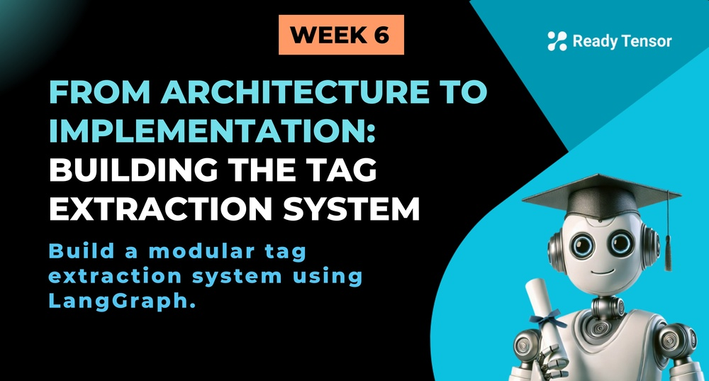
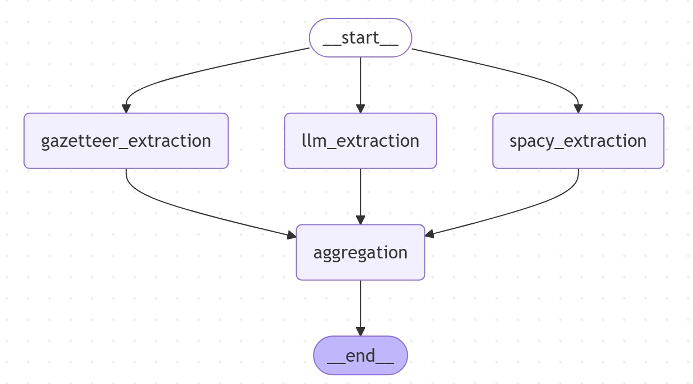

--DIVIDER--

---

# TL;DR

In this lesson, we move from architecture to implementation by building the tag extraction component of our Agentic Authoring Assistant. You’ll explore a real-world LangGraph system that combines three different extraction methods and uses an LLM to select the best tags. Along the way, we unpack the design choices, patterns, and tradeoffs that shaped the system — and reflect on where agents might fit in.

---

--DIVIDER--

# 🧭 From Vision to Code

In the [last lesson](https://app.readytensor.ai/publications/Gq1xQ27DmJ56), we introduced our Week 6 project — an **Agentic Authoring Assistant** to help generate titles, tags, summaries, and references for AI publications. As a learning exercise, we scoped down to one essential subsystem: **tag extraction**.

We described the design challenge, outlined the system’s requirements, and encouraged you to think through your own solution.

If you haven’t seen that lesson yet — or want a refresher on the architectural context — we strongly recommend you check it out first. It sets the stage for everything we’re about to build.

> 📎 [Go to “Defining Our Agentic Authoring Assistant” →](https://app.readytensor.ai/publications/Gq1xQ27DmJ56)

---

--DIVIDER--

# 🧱 The System at a Glance

Let’s start with a quick overview of the system we actually built.

--DIVIDER--

--DIVIDER--

The tag extractor is implemented as a **LangGraph**, with five key nodes:

- A **Start node** that fans out to three parallel extraction methods:

  - One using a simple **gazetteer lookup**
  - One using **spaCy’s NER model**
  - One using an **LLM-based extraction method**

- An **Aggregation node** that collects the results and uses an LLM to select the top _n_ final tags.
- An **End node** to close out the workflow.

It’s a small graph — but it surfaces a surprising number of interesting design decisions.

---

--DIVIDER--

:::info{title="Code + Video Walkthrough"}

 <h2>💻 Want to explore the implementation? </h2>
 
 The full code repository is linked with this lesson — and if you'd like a guided walkthrough, you’ll find a **video explanation near the bottom** of the page.  
 
 It covers the key components, node logic, and design decisions behind the system. Whether you prefer reading code or watching it in action, we’ve got you covered.
 
 :::
 
 ---

--DIVIDER--

# ❓ From Design to Decisions: What Did We Actually Build?

Now that you've seen it from above, let’s zoom in — not with code, but with answers to the kinds of questions a thoughtful system designer would ask.

We’ve grouped these questions into four themes:

- 🧠 **System Design & Architecture**
- 🤖 **Agentic Thinking**
- 🧩 **LLMs, Tools & Reasoning**
- 🧼 **Simplifications, Improvements & Production Readiness**

Each one explores a different aspect of how (and why) we built the system the way we did. If you're building your own version or just curious how agentic thinking shows up in practice — this is where it gets interesting.

Let’s dive in.

---

--DIVIDER--

## 🧠 **System Design & Architecture**

 <h3>What architectural pattern does this follow?</h3>
 It’s a simple **fan-out, fan-in** graph — the start node fans out to three parallel extraction methods, and their results feed into an aggregation node. You could also think of it as a lightweight **map-reduce** pattern.
 
 <h3>Why did we use three extraction methods instead of one?</h3>
 Because that’s how real systems work. Not everything needs to be a prompt. The gazetteer is fast and rule-based. spaCy brings proven ML capabilities. The LLM adds flexible reasoning. One goal of this lesson is to reinforce that agentic systems often combine traditional business logic, ML components, and LLM reasoning — each where it fits best. Use LLMs when you need intelligence, not just automation.
 
 <h3>Why not just do everything in a single LLM call?</h3>
 You could — but you'd lose control, explainability, and reusability. Breaking it into steps lets us mix techniques, inspect outputs, and improve individual components over time. It’s also cheaper to avoid over-relying on the LLM.
 
---

--DIVIDER--

## 🤖 **Agentic Thinking**

 <h3>How many agents did we use in this system?</h3>
 
 Zero. That’s right — no agents here. And that’s okay. This particular task didn’t require multi-turn decision-making, autonomy, or dynamic behavior. Everything was deterministic and direct.  
 
 That said, we **do** have two LLM-powered steps — one for extraction and one for aggregation — both of which involve reasoning. But these are simple function calls, not autonomous agents.
 
 Still, our results do show some **performance gaps** — especially in **tag quality and classification accuracy**. So while we didn’t use any agents in this version, it might make sense to introduce a **reflection or verification agent** in the future — one that reviews extracted tags, revises weak ones, or flags possible misses.
 
 This isn’t a failure of agentic thinking — it’s an example of it. We start simple, test assumptions, and introduce agents only when the problem demands it.
 
 <h3>So… is this even agentic?</h3>
 Yes — just not in the traditional “give the agent a goal and let it run” sense. The design and orchestration mindset is agentic: we’re using modularity, tool usage, and reasoning steps where appropriate. Think of it as agentic architecture, even if we didn’t need agentic autonomy here.
 
  
 
 <h3>Why didn’t we use agents to call the tools?</h3>
 Because there’s no real decision to make. Each tool is always run with known arguments. There’s no ambiguity, no reasoning-based branching or looping. Wrapping them in agents would’ve added complexity with no value.
 
  
 
 <h3>If we didn’t use agents, why did we even create and register tools?</h3>
 Because we want to leave the door open. These capabilities — like extracting entities — could absolutely be useful in more complex agentic systems. Registering them now means they’re ready to be used later, either manually or through agents who know how to invoke them.
 
  
 
 ---

--DIVIDER--

## 🧹 LLMs, Tools & Reasoning

 <h3> How many LLM-powered steps are there?</h3>
 
 Two:
 
 - One for extracting entities based on understanding (LLM-based extraction).
 - One for aggregating and selecting the top tags from all methods.
 
 That’s it.
 
 <h3> What’s the role of reasoning in this system, if any? </h3>
 
 It’s subtle. The LLM-based extractor does need to understand what makes a good tag — and that involves some reasoning. The aggregation step also balances clarity, coverage, and specificity.
 
 But we’re not using explicit chain-of-thought or reflection techniques yet.
 
 ---

--DIVIDER--

## 🫼 Improvements & Production Readiness

 <h3>  Is this graph flexible? Could we swap components easily? </h3>
 
 Yes — and that’s one of its strengths. Want to try a different NER model? Just update the spaCy node. Want to tweak the prompt? Change the config. Want to add a verification step? Add a node.
 
 This is one of the advantages of graph-based design: it’s composable.
 
 <h3>  What would it take to make this production-ready? </h3>
 
 A lot more:
 
 - Deduplication and normalization of tags
 - Better handling of synonyms and variants (e.g. “AI” vs “artificial intelligence”)
 - Thresholds or filters for relevance
 - Human-in-the-Loop for tag validation
 - Evaluation metrics to measure tag quality
 
 This is a learning scaffold, not a production stack — and that’s by design.
 
 <h3>  What improvements could we try next? </h3>
 
 Here are a few ideas:
 
 - Use a multi-class text classifier to improve tag classification
 - Try fine-tuning spaCy or adding your own gazetteer terms
 - Add a verification step or reflection agent to improve tag quality
 - Implement semantic de-duplication
 - Experiment with **reasoning strategies** like _Chain-of-Thought_ or _ReAct_ in the LLM-based extractor. Thanks to our modular prompt config and builder, it’s easy to try — just add the strategy to your prompt config file.
 
 This lesson is a sandbox — take it further.
 
 ---

--DIVIDER--

# 🎥 Code Walkthrough

Prefer to see it in action?

Check out the **video walkthrough** below — it covers the full implementation and key design decisions behind the system.

> > Video coming shortly!

---

--DIVIDER--

# ✅ Wrapping Up

This lesson showed how we translated an abstract architecture into a working system — combining traditional logic, ML models, and LLM-powered reasoning inside a modular LangGraph.

No agents this time. But still very much agentic.

It’s a reminder that good system design means using the right tools for the job — and leaving space to evolve when the job gets more complex.

Next, we’ll explore how more sophisticated agentic systems handle **collaboration**, **delegation**, and **decision-making** — going beyond standalone components into dynamic, multi-agent workflows.
