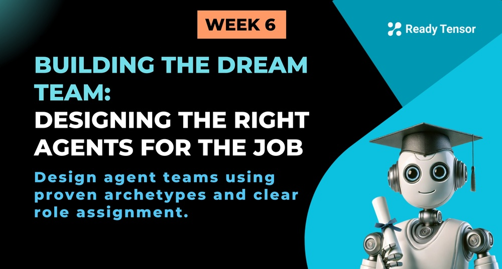

--DIVIDER--

---

# TL;DR

**Part 1 of 2:** Great agentic systems start with the right agents doing the right work. In this lesson, you'll learn how to map the essential work first, then design skill-based agents to handle it cleanly. You'll discover common agent archetypes (from Retrievers to Validators), avoid the traps of micro-agents and mega-agents, and ensure every piece of work is covered without overlap. Part 2 will cover how to make these agents work together effectively.

---

--DIVIDER--

# The Tag Extraction System: Behind the Choices

In the last two lessons, we walked through the [scope](https://app.readytensor.ai/publications/Gq1xQ27DmJ56) and [implementation](https://app.readytensor.ai/publications/D3vJsJh1500g) of the **tag extraction system**. As you followed along, you may have wondered:

- _How did they decide which parts needed agents?_
- _Why were some steps tools, others LLM calls, and some potential agents left out?_
- _Are there actual rules for how to define agent roles and put them together into a system?_

In this lesson, we’ll share our answers — not just theoretical best practices, but **practical guidance** drawn from experience. You’ll learn how to scope agent responsibilities, avoid common mistakes, and build agent teams that actually collaborate — instead of stepping on each other’s toes.

Let’s get into it.

---

--DIVIDER--

# Your North Star: Solve the Problem

Before we dive into roles, responsibilities, and design patterns, let’s be clear about what matters most: **your job is to solve the problem.**

That’s your North Star. Not elegant architecture diagrams. Not maximizing the number of agents. Not showcasing your graph-building skills.

Just build something that works — that gets the job done cleanly, reliably, and with minimal complexity.

That said, **design patterns and best practices exist for a reason**. They don’t guarantee success, but they can help you avoid common pitfalls, reduce fragility, and make your system easier to debug, extend, or reuse.

So don’t treat patterns like rules — treat them like guardrails. Let your problem drive the architecture, not the other way around.

---

--DIVIDER--

# 🧭 Start With the Work, Not the Workers

Before deciding which agents to build, start with a simple question:
**What needs to happen for this system to deliver value?**

We call this **mapping the knowledge work** — identifying the actual steps required to go from input to output. Not who does them, but what gets done.

Forget agent boundaries for now. Focus on the essential work:

- What must be retrieved, analyzed, or generated?
- Where is filtering, synthesis, or validation needed?
- What handoffs happen along the way?

Only once you’ve mapped this value path should you start designing the agentic system.
The goal isn’t to maximize agents — it’s to cover the right capabilities cleanly.

---

--DIVIDER--

# Two Extremes to Avoid

When designing agentic systems, people often fall into one of two traps:

- **One agent per task** — break everything into tiny steps and assign each to its own agent.
- **One agent per job title** — treat agents like people: “Researcher,” “Editor,” “Writer.”

Both sound structured. Both usually fall apart.

---

## 🔹 The Problem with Task-Based Agents

Let’s say you’re building a **References Generator** — a system that takes a project description and returns a list of relevant papers, online articles, or blog posts. You might start by splitting the process:

- Extract key concepts
- Generate search queries
- Run a web search
- Filter results
- Remove duplicates
- Rank for relevance
- Format citations

Each step becomes its own agent. You end up with a dozen tiny agents, all hard-coded to a specific function.

Sure, it works. But the result is:

- **Too fragile** — one agent fails and rest of your assembly line breaks
- **Not reusable** — nothing carries over to other projects

Take a “Web Search Agent.” If tomorrow you want to support arXiv, Google Scholar, or a custom database — do you build new agents for each?

Or do you build one smart retriever agent and give it the tools it needs?

That’s the difference between hard-coding and modular design.

And when you move on to something like a **Literature Review Assistant**, the first few steps — extract concepts, search, filter — are exactly the same.

If your agents are modular, you reuse them.
If they’re overfitted, you start over.

---

## 🔹 The Problem with Broad Role-Based Agents

On the flip side, defining agents by job titles feels intuitive — but often leads to:

- Overloaded responsibilities
- Unpredictable behavior
- Debugging nightmares

What does a “Researcher Agent” really do? Is it searching? Filtering? Scoring? Summarizing? Fact-checking? All of the above?

If it’s doing too much, it’s doing too little of it well.

---

--DIVIDER--

# ✅ The Sweet Spot: Skill-Based Agents

So what's the alternative? Focus on **skills**, not tasks or titles.

Some capabilities show up everywhere — retrieving information, filtering results, judging relevance, or summarizing content. These are the building blocks you'll use across projects.

Build agents around these core skills. Make them flexible through prompt injection and structured inputs. Then compose them into workflows as needed.

Your "Web Search Agent" becomes a "Retrieval Agent" that can search the web, query databases, or scan documents. Your “Reference Picker” becomes a Selection Agent that can rank papers, choose the best tags, or filter top results in any domain given the right context.

Not every agent needs to be generalized — some will be specific to your use case. But when you spot these recurring skills, design for flexibility and re-use.

Let's look at the most common ones.

---

--DIVIDER--

# 🧠 Common Agent Roles

When building agentic systems, certain roles come up again and again. Instead of designing agents from scratch each time, it helps to think in terms of **reusable skills** — like retrieving information, generating content, or validating outputs.

Below are the most common agent types, organized by function. These are your core building blocks — modular, composable, and useful across many systems.

--DIVIDER--

---

--DIVIDER--

## 🧭 Orchestration

These agents manage flow and structure.

 <h3>Planner</h3>
 
 - Breaks down a high-level goal into smaller steps.
 - Can benefit from Chain of Thought or Self-Ask for goal decomposition.
 - No tools needed.
 
 <h3>Coordinator</h3>
 
 - Manages branching logic or parallel execution.
 - No tools or reasoning typically required — implemented with graph logic.

--DIVIDER--

## 🔍 Information Retrieval

These agents gather and organize relevant inputs.

 <h3>Retriever </h3>
 
 - Locates relevant content via search or queries.
 - Examples: Web search (SerpAPI), vector DB lookup (Pinecone), database queries.
 - Requires tools.
 - No reasoning usually required.
 
 <h3>Extractor  </h3>
 
 - Identifies concepts, terms, or entities from text.
 - Examples: Tag extraction, topic detection, NER.
 - May use tools like spaCy or keyword matchers, or topic detection models.
 
 <h3>Selector </h3>
 
 - Chooses or ranks the best results from a list.
 - Examples: Pick top-n tags, select best answer from candidate responses.
 - Can benefit from rationale-based selection or reflection-based ranking.
 
 ---

--DIVIDER--

## 🛠️ Content Processing & Creation

These agents transform or synthesize content.

 <h3>Generator  </h3>
 
 - Produces original content from context and instructions.
 - Examples: Answer a question, write a title, draft an abstract.
 - Can benefit from Chain of Thought, Few-shot, or ReAct.
 
 <h3>Summarizer</h3>
 
 - Condenses content while preserving key meaning.
 - Examples: TL;DR, highlights, executive summaries.
 - Reasoning may help when summarizing lengthy context. Can benefit from few-shot examples.
 
 <h3>Refiner </h3>
 
 - Improves or adapts existing content.
 - Examples: Simplify language, change tone, change/fix structure.
 - Can benefit from feedback loops or few-shot examples.
 
 <h3>Analyzer </h3>
 
 - Examines data to extract insights or patterns.
 - Examples: Sentiment trends, evaluation results, sql query or pandas analysis.
 - Typically needs external tools (e.g., stats, sql, tabular analysis tools).
 
 <h3>Aggregator  </h3>
 
 - Merges multiple outputs into a single result. Typically for _reduce_ operations in map-reduce style tasks.
 - Examples: Combine candidate tags, stitch together summaries.
 
---

--DIVIDER--

## ✅ Evaluation

These agents judge and improve quality.

 <h3>Reviewer</h3>
 
 - Critiques and suggests improvements. Usually part of **generate-reflect** loops.
 - Examples: Writing feedback, tone/style issues, structure comments.
 - Can benefit from few-shot and reflective prompting.
 
 <h3>Validator</h3>
 
 - Checks for strict correctness rules. Flags issues or confirms compliance.
 - Examples: Fact-checking, completeness-check, checklists.
 - Often uses tools like checkers, regex, or structured validators. Reasoning not typically needed.
 
---

--DIVIDER--

## ⚙️ Action

These agents trigger effects beyond the system.

 <h3>Executor</h3>
 
 - Performs real-world actions. Logic is typically deterministic. Agentic out of convenience, not necessity.
 - Examples: Send email, save to DB, call external APIs, post to Slack.
 - Always tool-based. No reasoning required.
 
 ---

--DIVIDER--

# From Skills to Structure: Assigning the Right Work to the Right Agents

By now, you’ve done the groundwork. You’ve clarified the problem, mapped the key work involved, identified the core skills required, and chosen the agents to match.

Now comes the important next step:
**Assign that work cleanly — and make sure every piece is covered.**

This is where things can go wrong if you’re not careful. Even with the right agents in hand, it’s easy to:

- Leave out a necessary step (a gap)
- Give two agents overlapping jobs (a conflict)

Let’s look at how to spot those before they trip you up.

---

## 🔍 Example: A Gap in the Pipeline

Let’s say you’re building a system that pulls external content into an article:

1.  **Retriever** runs a web search and returns 10 results
2.  **Selector** picks the top 3 most relevant results
3.  **Generator** uses them to answer a research question

Sounds reasonable — until you look closer.

Web pages are full of clutter: ads, headers, unrelated text. Even your “best” results still contain noise. If you pass those raw into the Generator, you’re setting it up to fail.

> What’s missing? A **Summarizer** or **Refiner** to clean and compress the selected results before generating anything.

That’s a gap. A skill your system needs — but doesn’t have.

---

## ♻️ Example: An Overlap in the Flow

Now imagine you’ve assigned both a **Summarizer** and a **Refiner** to process the same text.

- The Summarizer shortens it.
- The Refiner rewrites it for tone and clarity.

Do you need both? Or is one doing the other’s job?

> Overlaps create unnecessary complexity — and make debugging painful.

---

## ✅ The Fix: Trace the Information Path

Walk through your system and ask:

- What does each agent receive?
- What’s the output supposed to be? What does it actually look like?
- Is anything noisy, unstructured, or missing?
- Are two agents doing the same thing?

Mapping the flow helps catch what’s missing — and what’s unnecessary.

---

--DIVIDER--

## 🧱 From Agents to Pipeline

So now you've mapped the whole system: the knowledge work is covered, the agents are clearly defined, and the value path flows from start to finish.

Tempted to string it all into one neat sequence?

**Hold up.**

Just having the right agents in the right order doesn’t guarantee a working system. In agentic AI, **collaboration matters** — and that means thinking beyond just who does what.

To make your system _robust and reliable_, you’ll need:

- **Checkpoints** to verify quality along the way
- **Parallelization** to speed things up when steps don’t depend on each other
- **Controllers** to manage flow, retries, and fallback paths

In other words: good agents need a good playbook. Without it, you'll face coordination breakdowns, cascade failures, and the kind of multi-agent chaos that makes debugging a nightmare.

We’ll cover all of that in **Part 2**.

---

--DIVIDER--

### ▶️ Coming Up:

**_Building the Dream Team: Making Agents Work as a Team_**
How to coordinate agents, structure collaboration, and build systems that hold up under pressure.

---
