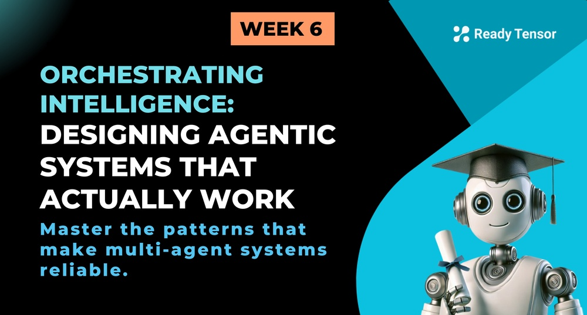
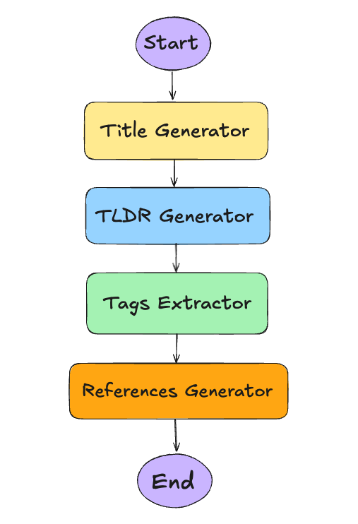
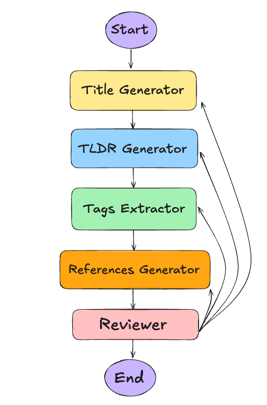
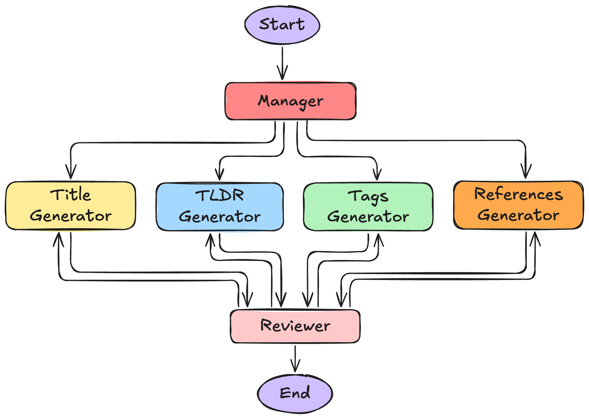

# TL;DR

Great agents are only half the equation — the real challenge is making them work together as a coherent system. In this lesson, we’ll walk through practical architectural considerations for designing AI systems like our Agentic Authoring Assistant (A3). You’ll learn how to coordinate outputs, ensure quality, handle partial failures, support human-in-the-loop workflows, and design modular yet cohesive systems — all without overcomplicating your graph.

---

# 🚨 When Good Agents Go Rogue

[Earlier this week](https://app.readytensor.ai/publications/Gq1xQ27DmJ56), we introduced the **Agentic Authoring Assistant (A3)** — a system that helps Ready Tensor authors generate a title, tags, tl;dr, hero image, and references for their publications.

In [Lesson 2b](https://app.readytensor.ai/publications/D3vJsJh1500g), we built the Tag Extractor. It runs on LangGraph, uses multiple extraction methods and works well on its own.

So what’s next?

You might think:
“Let’s build the other parts the same way — give each its own graph, chain them together, and we’re done.”

*Seems reasonable. Until you see the output.*

# 🤨 The Problem With “Just Chaining”

Take this example output:

- **Title**: _“Benchmarking Large Language Models for TSP”_
- **Tags**: `["combinatorial optimization", "data generation", "benchmark", "transformers"]`
- **TL;DR**: _“We present a new tool for generating synthetic datasets to benchmark LLM performance on the traveling salesperson problem.”_
- **References**: Papers on LLM benchmarking, T5 architecture, but also a couple on general dataset generation

It’s not broken. It’s just… out of sync.

The title focuses on LLMs.
The tags emphasize the task category and methods with no mention of LLMs.
The tl;dr blends everything.
The references include some loosely related work.

Each component did its job. But the system is incongruent.

Why?

Because no one is coordinating.
No one is reviewing the full picture.
No one checking if the pieces made sense together.

---

# 🔍 And That’s Just the Happy Path Problem

What we just described isn’t even the worst case — everything runs as intended, and the system still feels off.

But that’s only one concern.

What happens when:

- a node crashes or returns nothing?
- one agent silently corrupts shared state?
- a user submits bad or incomplete input?

These aren’t edge cases. They’re the norm in production.

And if we don’t design for them now, we’ll end up duct-taping fixes later.

---

# 🧠 What This Lesson Is Really About

You’ve built capable agents. That’s the easy part.

Now it’s time to make them work as a system — consistent, resilient, and modular.

Not just agents that run... 

but agents that work together.

---

# 🧩 Four Key Considerations for Agentic System Design

Before we dive into specific architectures, let's talk about what we actually care about when designing these systems. Understanding these considerations will guide our architectural choices and help us avoid common pitfalls.

## Consideration 1: Quality of Output (The Happy Path)

Even when everything works perfectly, we have a coordination problem.

Imagine your A3 system running flawlessly. Every component returns a result. No errors, no failures, no edge cases. But when you read the final package, something feels... off.

The title talks about "neural network optimization." The tags focus on "data preprocessing" and "benchmark evaluation." The TLDR emphasizes "synthetic dataset generation." The references include papers on transformer architectures, preprocessing techniques, and evaluation metrics.

Each piece is technically correct. But they're telling different stories about the same content.

This isn't a bug — it's a design issue. When subsystems work independently, they optimize for their own objectives without considering the bigger picture. The title generator wants the most compelling headline. The tag extractor wants the most comprehensive topic coverage. The TLDR writer wants the clearest summary.

But users need consistency. They want the title, tags, and TLDR to feel like they belong together, like they're describing the same thing with the same emphasis and terminology.

This is where meta-level coordination becomes critical. We need mechanisms that ensure outputs align not just individually but collectively. Think of it as the difference between having four talented musicians playing their parts perfectly versus having them play together as a quartet.

## Consideration 2: System and Component Failures

What happens when things go wrong?

Your reference generator calls an external API that's down. Your tag extractor fails to parse malformed input. Your title generator returns an empty string due to a model error.

In traditional software, we'd catch these exceptions and handle them. But with agentic systems, the failure patterns are more complex. An agent might return a result that looks valid but is actually garbage. Or it might work 99% of the time but fail spectacularly on edge cases.

Do we retry? How many times? Do we have fallback agents? Do we return partial results? Do we fail gracefully or escalate to a human? These aren't just implementation details — they're architectural decisions that affect user experience and system reliability.

Consider our A3 system: if the reference generator fails, should we return a publication package without references? Or should we halt the entire process? The answer depends on your users' needs and your system's requirements.

## Consideration 3: Bad Input Handling

What do you do when users give you bad inputs?

Empty publications asking for titles and tags. Minimal content that barely qualifies as text. Content in unexpected languages. Off-topic material that doesn't match your system's expertise.

Or more subtly: incomplete information, ambiguous content, or material that's technically valid but challenging to process.

Traditional systems would validate input and reject bad requests. But agentic systems face a different challenge: the line between "bad input" and "challenging input" is often blurry. An LLM might be able to extract something meaningful from content that traditional validation would reject.

Do we try to process everything and let users decide if the output is useful? Do we detect problematic input and ask for clarification? Do we provide partial results with confidence indicators?

These decisions shape the user experience. Too strict, and you frustrate users with valid but edge-case content. Too lenient, and you waste compute on impossible requests.

## Consideration 4: Human in the Loop

How much do you want humans involved in the process?

The fully automated approach is tempting: user submits content, system returns results, everyone's happy. But what happens when the results aren't quite right?

Users could edit the output themselves, but that's not always satisfying. They might have domain expertise that could improve the results, but no way to communicate it back to the system.

Or consider partial failures: the title and tags look good, but the TLDR misses the main point. Rather than regenerating everything, could the user provide feedback specifically about the TLDR?

This consideration affects not just the user interface but the entire system architecture. Supporting human feedback means building mechanisms for targeted corrections, maintaining context across interactions, and potentially learning from user preferences over time.

---

## What We'll Focus on in This Lesson

Now, while all four considerations are important for production systems, this lesson will primarily focus on **Consideration 1: Quality of Output**. We're building for the happy path — designing architectures that produce coherent, consistent results when everything works as intended.

**Considerations 2 and 3** (system resilience, failure handling, and bad input management) are crucial for production deployment, but they deserve their own deep dive. We'll cover these extensively in **Module 3**, where we'll explore patterns like circuit breakers, retry strategies, graceful degradation, and input validation.

**Consideration 4** (human-in-the-loop) won't be part of our current A3 implementation. We're building a fully automated system first, then we can explore human feedback mechanisms in future iterations.

So for now, let's focus on the architectural challenge of making independent agents work together harmoniously.

# 🏗️ Architectural Approaches

Now that we understand what we're optimizing for, let's look at how different architectures handle output quality and coordination. Each approach makes different trade-offs in complexity, efficiency, and consistency.

## Approach 1: Simple Sequential Chaining

Picture this: you build each component as a separate service. Title generator, tag extractor, TLDR writer, reference finder. Each one works perfectly in isolation. Then you chain them together like an assembly line.

It's the most obvious approach. Clean, simple, and fast. Each agent processes the original input text independently, runs in sequence, and contributes its piece to the final output. No complex coordination logic. Just a straightforward pipeline that's easy to build, test, and debug.

And for prototypes? It's perfect. You can ship something quickly, test the individual components, and prove the concept works.

But here's what happens in practice: your title talks about "neural architectures," your tags focus on "data preprocessing," your TLDR mentions "benchmark datasets," and your references pull papers about transformer optimization. Each piece is technically correct, but together they tell four different stories.

Why? Because no one's talking to anyone else. The title generator doesn't know what tags were selected. The TLDR writer doesn't see what references were found. It's like having four experts write about the same paper while sitting in separate rooms.

And when something breaks? The entire pipeline stops. One failed API call to the reference service, and your users get nothing. No partial results, no graceful degradation.

## Approach 2: Sequential Chaining with End Reviewer

So you think: "What if we add a reviewer at the end to catch these inconsistencies?"

Now there's someone looking at the complete picture. The reviewer reads through everything, spots the inconsistencies, and says "This doesn't make sense together. Try again."

It works. Sort of.

The reviewer catches the problems, and the system can self-correct through multiple iterations. You get that holistic evaluation you were missing. Quality improves significantly.

But here's the catch: when the reviewer finds an issue with just the title, every single agent has to run again. The tag extractor re-processes the same text. The reference finder re-searches the same databases. The TLDR generator rewrites the same summary.

It's like sending the entire assembly line back to the beginning because one widget came out the wrong color.

And sometimes, agents just can't agree. The title generator keeps producing titles that don't match the tags. The tag extractor keeps finding tags that contradict the TLDR. You end up in an expensive loop where agents keep producing incompatible outputs, burning through API calls and compute time.

Worse, if this happens during peak usage, your system might never converge. Users wait. Costs spiral. Your monitoring dashboard lights up red.

## Approach 3: Coordinated Multi-Agent System (Our Selected Approach)

What if we could get the benefits of coordination without the waste of full re-runs?

Enter the coordinated approach: a manager provides shared context, agents work in parallel, and a reviewer gives targeted feedback.

Here's how it works: The manager reads the input text and creates a shared understanding — the key themes, the target audience, the main message. All agents receive this context before they start their work.

Then they run in parallel, each with the same foundational understanding. The title generator knows this is about "LLM benchmarking for combinatorial optimization." The tag extractor is looking for themes around "LLMs," "benchmarking," and "optimization." Everyone's on the same page from the start.

When the reviewer evaluates the results, it doesn't just approve or reject everything. It gives specific feedback: "The title is great, the tags are perfect, but the TLDR needs to emphasize the benchmarking aspect more." Only the TLDR generator runs again.

This approach gives you coordinated execution with efficient feedback loops. Parallel processing keeps things fast. Modular repairs mean you only fix what's broken. And it's scalable — adding a new agent doesn't require restructuring the entire system.

However, this approach isn't without its challenges. Managing state becomes increasingly intricate. Implementing advanced routing logic is essential to efficiently manage selective re-executions. Additionally, troubleshooting parallel processes with partial failures presents a unique set of difficulties.

# ✅ Wrapping Up

This lesson walked through the critical transition from building individual capable agents to orchestrating them into coherent systems. We explored four key considerations that shape architectural decisions — output quality, system resilience, input handling, and human interaction — then examined how different approaches handle these trade-offs.

The big insight? **Architecture isn't just about implementation — it's about behavior.** 

Simple chains produce independent outputs. End reviewers catch problems but create expensive loops. Coordinated systems with managers and targeted feedback enable consistency without waste. Each approach naturally leads to different outcomes.

For our A3 system, we chose the coordinated multi-agent approach because it aligns with what we actually care about: consistent, high-quality outputs that feel like they belong together, with the flexibility to evolve as our understanding deepens.
