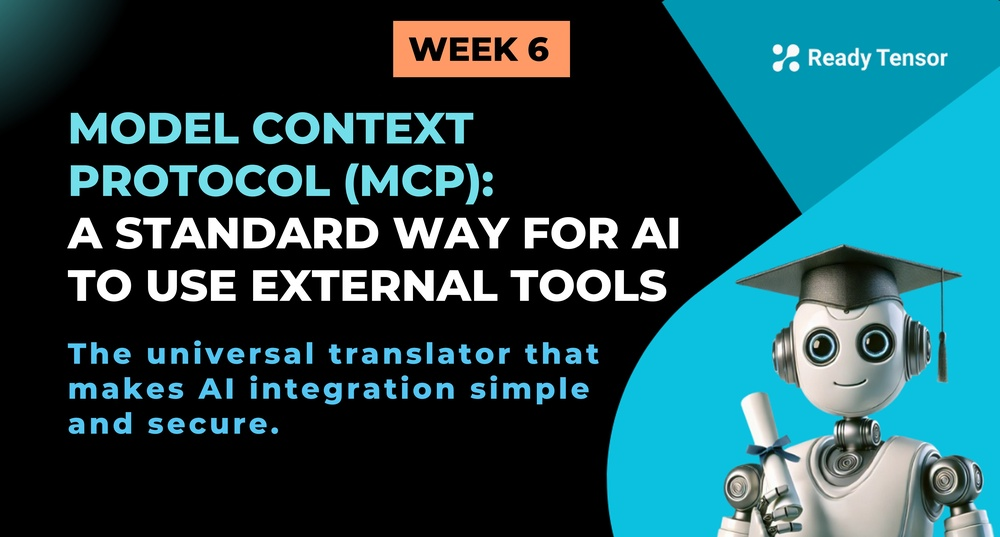
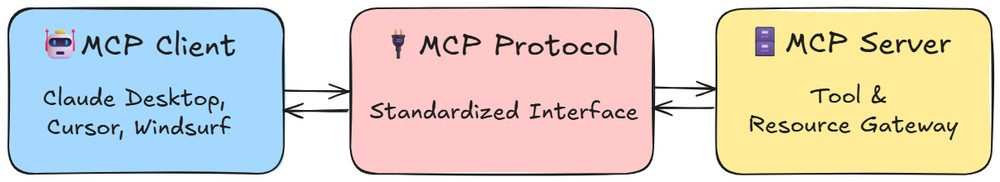
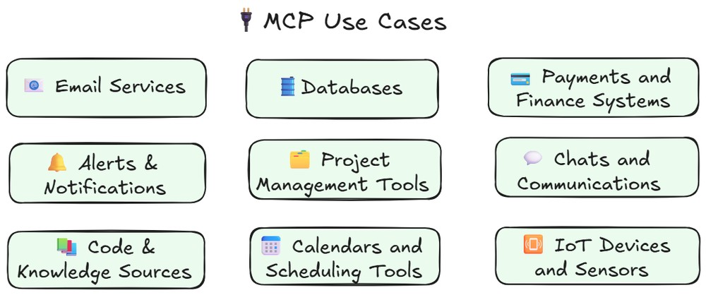

---

--DIVIDER--# TL;DR

MCP is a standardized protocol that allows AI agents to securely and seamlessly interact with external tools and data — doing for AI what HTTP did for the web. It simplifies integrations, enforces security, and makes AI systems more modular, scalable, and production-ready.

--DIVIDER--

---

[🏠 Home - All Lessons](https://app.readytensor.ai/hubs/ready_tensor_certifications)

[⬅️ Previous - Designing Right Agents](https://app.readytensor.ai/publications/qtRz3uuXGx5Y)
[➡️ Next - Integrating MCP](https://app.readytensor.ai/publications/35v0wzEbKZBo)

-----DIVIDER--# The Integration Chaos Before MCP

Think back to the early days of the internet. Every website spoke its own language, every service had its own way of doing things, and connecting different systems was like trying to have a conversation where everyone spoke a different dialect. Then came HTTP, a universal protocol that made the web what it is today.

**Model Context Protocol (MCP) is doing for AI Agents, tools and data what HTTP did for web communication: making them universally accessible, composable, and easier to integrate.**

MCP was developed by the brilliant minds at Anthropic (the same team who created Claude). It acts as a standardized "handshake" that allows AI models to securely connect with external data sources and tools. It's like giving your AI a universal translator that can speak to any system, anywhere.

---

--DIVIDER--

# The Problem MCP Solves

Before MCP, building AI integrations was... well, kind of a nightmare. Here's what we developers had to deal with:

## The Integration Hell

- **Custom Everything**: Want your AI to read a folder of PDFs? You build a custom integration.
  Need it to query arXiv or Google Scholar? Another one. Pull issues or code from GitHub? Yet another.

- **Security Nightmares**: Each integration had its own security model, authentication method, and permission system. It was like having a different key for every door in your house.

- **Maintenance Madness**: Every time an API changed or a new AI model came out, we developers had to update dozens of custom integrations.

- **Reinventing the Wheel**: Every team was solving the same problems over and over again, just in slightly different ways.

## The Broken Telephone Effect

Imagine trying to play telephone with 50 people, where each person speaks a different language and uses different rules. That's what AI integration looked like before MCP. Messages got lost, data got corrupted, and developers got grey hair (lots of it).

---

--DIVIDER--

# Enter MCP: The Game Changer 🚀

MCP swoops in like a superhero and says, "What if we all just agreed on how to talk to each other?" It provides:

1.  Universal Standards: Just like HTTP gave us standards for web communication, MCP gives us standards for AI-tool communication. No more custom protocols, no more proprietary formats, just one beautiful, consistent way to connect everything.

2.  Security First: MCP doesn't just make connections possible; it makes them secure. It has built-in authentication, permission management, and data protection that work the same way across all integrations.

3.  Plug and Play: Need to connect a new data source? With MCP, it’s as simple as plugging in a USB drive — no more scraping APIs or writing brittle wrappers. The protocol handles all the heavy lifting for you, and you just focus on what you want your AI to do with the data.

---

--DIVIDER--

# MCP Architecture Overview

The MCP architecture follows a client-server model with three main components:

## MCP Client

The MCP client is typically integrated into AI applications, IDEs, or other host environments (This is the application that will be making use of the MCP servers). Key characteristics:

- **Role**: It initiates connections and sends requests to MCP servers
- **Implementation**: It is usually embedded within larger applications (like Claude Desktop, IDEs, or any custom AI application you are building)

- **Responsibilities**:
  - Discovers and connects to available MCP servers
  - Manages authentication and security
  - Translates user requests into MCP protocol messages
  - Handles responses and presents data to the AI or user interface
- **Examples**: Claude Desktop app, VS Code extensions, custom AI applications

## MCP Protocol

The protocol layer defines the communication standard between clients and servers:

- **Transport**: Typically uses JSON-RPC 2.0 over various transport mechanisms

- **Connection Types**:

  - Standard I/O (stdio) - most common for local servers
  - Server-Sent Events (SSE) for web-based implementations
  - WebSocket connections for real-time communication

- **Message Types**:

  - **Resources**: Static or dynamic data that can be read
  - **Tools**: Functions that can be called to perform actions
  - **Prompts**: Template prompts that can be instantiated

- **Security**: Built-in authentication and capability negotiation
- **Standardization**: Ensures interoperability between different implementations

## MCP Server

MCP servers provide access to specific data sources, APIs, or tools:

- **Role**: Exposes capabilities and data through the MCP protocol

- **Implementation**: Standalone processes or services

- **Capabilities**:

  - **Resource Providers**: Serve files, databases, APIs, or other data sources
  - **Tool Providers**: Expose functions for actions like file operations, calculations, or API calls
  - **Prompt Providers**: Offer reusable prompt templates

- **Examples of Popular MCP Servers**:
- [Click on this link to see some popular MCP servers that are already out for usage](https://github.com/wong2/awesome-mcp-servers)

---

--DIVIDER--# What MCP Unlocks for AI Builders 🎮

Let’s be honest — most of us have duct-taped external tools into our AI systems more times than we can count. Every one-off integration starts simple… until it snowballs into auth issues, data mismatches, and maintenance overhead.

**Now imagine a world where your AI can access external services — like databases, email systems, calendars, payment APIs, or even IoT devices — all through a single, consistent interface.**

 
<em>Example services your AI can access via MCP — no custom glue code required.</em>

 
 
 MCP changes the game by giving us:
 
 - **Speed**: You don’t need to hand-code every connector. Plug in an MCP-compatible server, and your agent knows what tools are available and how to use them.
 - **Modularity**: Add or remove capabilities without refactoring your whole pipeline. MCP makes external tools feel like reusable building blocks.
 - **Security**: With built-in permissioning, authentication, and protocol consistency, you stop worrying about exposing sensitive APIs or mishandling data.
 - **Focus**: You get to work on actual intelligence — planning, coordination, reasoning — instead of patching HTTP requests.
 - **Future-readiness**: As more tools adopt MCP, your agent’s capabilities grow. You’re not just building a one-off system — you’re building on a growing ecosystem.
 
 Want your agent to read from a publication index, summarize research, and cross-check references from an external source? With MCP, those are just tools — not new custom builds.
 
 ---
 --DIVIDER--
 # How MCP Works (Communication Flow)
 At a high level, MCP defines a clear lifecycle for how AI systems can discover and use external capabilities, structured around four simple stages:
 
 1. Discovery – The AI client retrieves a manifest of available tools, resources, and templates from an MCP server. This manifest tells the model what’s possible.
 
 2. Request – Based on user input, the model selects and calls the appropriate tool (e.g., send_email(to, subject, body)) using the standardized format.
 
 3. Execute – The MCP server handles the actual execution—whether that means calling an external API, querying a database, or processing a file.
 
 4. Response – The execution result is returned to the client and integrated into the model’s next response or action.
 
 
 
 
 This protocolized exchange allows models to plan, reason, and act without needing brittle, model-specific integrations.
 
 This step-by-step interaction turns what used to be opaque, hardcoded integrations into a modular, discoverable protocol that models can navigate dynamically.
 
 ---
 
 
 --DIVIDER--# What’s Next?
 
 In this lesson, we explored how MCP standardizes AI integration by acting as a universal protocol between clients, tools, and data. But theory is only half the story.
 
 👉 **In the next lesson, we'll take a look at how to actually use existing MCP servers—and even how to create our own.** You’ll learn how to plug into popular tools with just a few lines of code and expose your own APIs, databases, or functions through MCP.
 
 Get ready to go from understanding MCP to building with it.
 
 ---
 
 --DIVIDER--
 ---
 
 [🏠 Home - All Lessons](https://app.readytensor.ai/hubs/ready_tensor_certifications)  
 
 [⬅️ Previous - Designing Right Agents](https://app.readytensor.ai/publications/qtRz3uuXGx5Y) 
 [➡️ Next - Integrating MCP](https://app.readytensor.ai/publications/35v0wzEbKZBo) 
 
 ---
