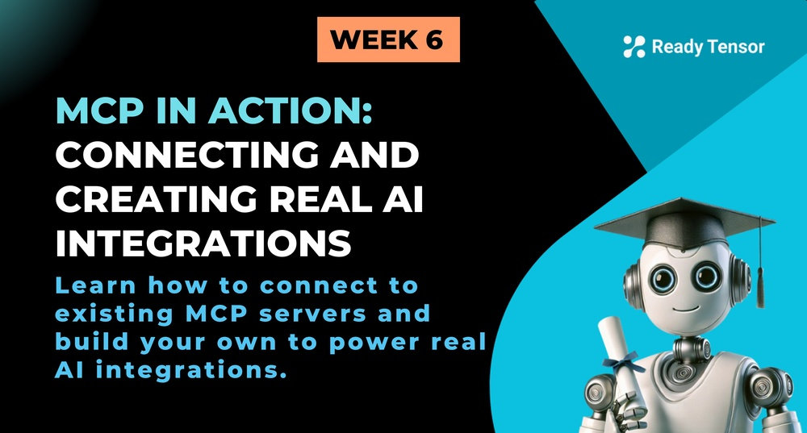

--DIVIDER--

---

[🏠 Home - All Lessons](https://app.readytensor.ai/hubs/ready_tensor_certifications)

[⬅️ Previous - Introducing MCP](https://app.readytensor.ai/publications/LAeGUSWv4dKb)

---

--DIVIDER--

# TL;DR

This lesson takes you from MCP theory to practice. You'll learn how to connect existing MCP servers to your AI applications and build your own custom MCP server from scratch. By the end, you'll have a working MCP integration that you can actually use.

--DIVIDER--

# From Theory to Practice 🛠️

In our last lesson, we explored how MCP is revolutionizing AI integrations by providing a universal protocol. Now it's time to roll up our sleeves and build something real.

Think of this lesson as your "Hello World" moment for MCP. Just like you probably wrote your first "Hello World" program when learning to code, we're going to build your first MCP integration. But instead of just printing text to a console, we're going to connect AI to real tools and data.

--DIVIDER--

# The Two Sides of MCP Development

There are two main ways you'll work with MCP in the real world:

**1. The Consumer Side**: Connecting to existing MCP servers (like plugging into a power outlet)
**2. The Producer Side**: Building your own MCP servers (like building the power plant)

Most of the time, you'll start as a consumer—using the amazing MCP servers that the community has already built. But as your needs grow, you'll want to expose your own data and tools through MCP servers.

We're going to cover both sides today.

---

--DIVIDER--

# Part 1: Connecting to Existing MCP Servers 🔌

## The MCP Ecosystem is Already Rich

Before we dive into building, let's appreciate what's already out there. The MCP ecosystem has exploded since its launch, with servers for:

- **File Systems**: Read and write files locally or in the cloud
- **Databases**: Query SQL databases, NoSQL stores, and vector databases
- **APIs**: Connect to REST APIs, GraphQL endpoints, and webhooks
- **Development Tools**: Git operations, code analysis, and deployment tools
- **Productivity**: Calendar management, email, and task tracking
- **Data Processing**: CSV manipulation, JSON parsing, and data transformation

## Setting Up Your First MCP Connection

Let's start with something practical—connecting to a file system MCP server. This is like giving your AI the ability to read and write files on your computer.

---

--DIVIDER--

## 🎥 Code Walkthrough – Connecting to Existing MCP Servers

In this video, we show how to connect an AI agent to existing MCP servers, using the GitHub server as an example. You’ll see how to configure the connection and use tools like repository creation and file pushing.

:::youtube[Connecting AI Agents to Existing Tools]{#C2vAeCShSRc}

## The Magic Moment ✨

When you see your AI successfully read a file through MCP for the first time, something clicks. You realize that you've just given your AI "eyes" into your file system without writing a single line of custom integration code.

That's the MCP magic—complex integrations become simple configurations.

---

--DIVIDER--

## Popular MCP Servers You Should Know About

Here are some MCP servers that will immediately make your AI more powerful:

**Example Servers:**

- [Filesystem MCP Server](https://github.com/modelcontextprotocol/servers/tree/main/src/filesystem): File operations (read, write, search)
- [Git MCP Server](https://github.com/modelcontextprotocol/servers/tree/main/src/git): Git operations (status, commit, branch)
- [Fetch MCP Server](https://github.com/modelcontextprotocol/servers/tree/main/src/fetch): HTTP requests and API calls

--DIVIDER--

## Configuration Patterns

Most MCP servers follow similar configuration patterns:

This is an example configuration that gives the client access to two MCP servers, the Github server and a custom server written by us.

```json
{
  "mcpServers": {
    "my-custom-server": {
      "command": "python",
      "args": ["server.py"]
    },
    "GitHub": {
      "command": "npx",
      "args": ["-y", "@modelcontextprotocol/server-github"],
      "env": {
        "GITHUB_PERSONAL_ACCESS_TOKEN": "your github token"
      }
    }
  }
}
```

The beauty is in the consistency—once you understand one MCP server configuration, you understand them all.

---

--DIVIDER--

# Part 2: Building Your Own MCP Server 🏗️

## When to Build Your Own Server

You'll want to build your own MCP server when:

- You have proprietary data or APIs that aren't covered by existing servers
- You need custom business logic that goes beyond simple data access
- You want to expose internal tools to AI in a controlled way
- You're building a product that others will integrate with

## The Anatomy of an MCP Server

Every MCP server has three main components:

1.  **Resources**: Static or dynamic data (files, database records, API responses)
2.  **Tools**: Functions that perform actions (send email, create file, update database)
3.  **Prompts**: Reusable prompt templates for common tasks

## Building Your First MCP Server

Let's build a simple but useful MCP server that manages a task list. This will give you hands-on experience with all the core MCP concepts.

---

--DIVIDER--

## 🎥 Code Walkthrough – Building a Custom MCP Server

In this video, we walk through building a custom MCP server in Python, exposing your own tools (like reading a README or fetching repo owner info) and connecting them to an AI agent.

:::youtube[Build and Integrate Your Own Tools Via MCP]{#17WJQ7Ya9qU}

---

--DIVIDER--

# Wrapping Up:

In this lesson, you moved from understanding what MCP is to actually using it. You saw firsthand how to connect to powerful existing MCP servers and even how to build your own from scratch—opening the door to secure, modular, and scalable AI integrations.

You didn’t just learn a new tool—you learned a new way of thinking about how AI can interact with the world around it.

The best part? This is just the beginning.

--DIVIDER--

---

[🏠 Home - All Lessons](https://app.readytensor.ai/hubs/ready_tensor_certifications)

[⬅️ Previous - Introducing MCP](https://app.readytensor.ai/publications/LAeGUSWv4dKb)

---
