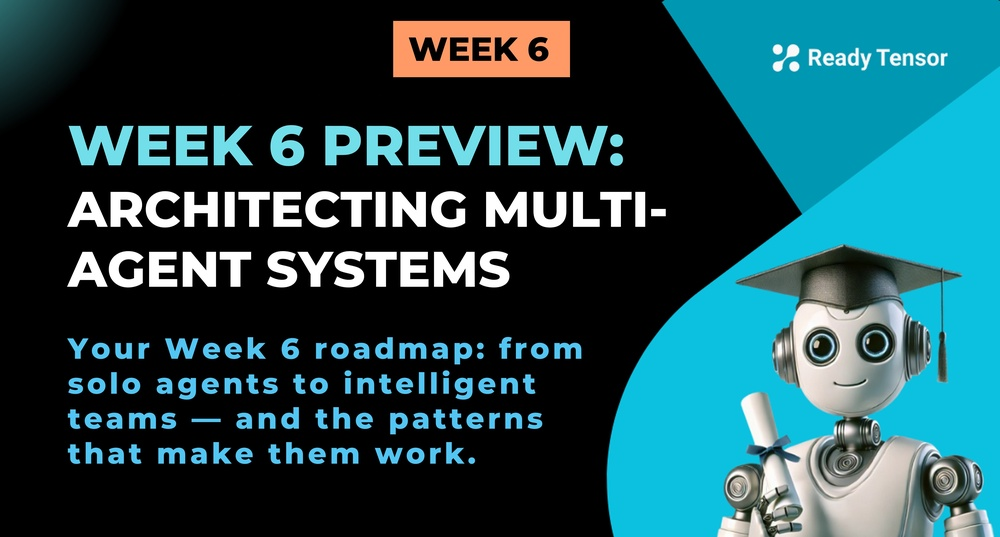

--DIVIDER--

# Welcome to Week 6 of the Agentic AI Developer Certification Program! 🧠🤝

In Week 5, you built your first real agentic systems — dynamic assistants powered by LangGraph, memory, tools, and observability — and experienced the shift from static workflows to intelligent, stateful agents.

Now we go further.

**This week, you’ll move from building individual agents to designing entire teams of them.** You’ll learn how to architect multi-agent systems — systems where agents specialize, collaborate, and sometimes even disagree. This is where agentic AI stops being linear and starts getting intelligent.

By the end of this week, you’ll be thinking like an agent system designer and architect, not just a developer. You’ll know how to delegate tasks across agents, resolve conflicts, implement custom tool-sharing strategies, and even connect to agents outside your system via MCP.

Let’s build some brains that work together.

---

--DIVIDER--

# 📝 What’s in store this week?

Here’s how the week is structured:

**Lesson 1**: Learn the building blocks of multi-agent systems and architectural patterns  
 **Lesson 2**: Build your first multi-agent system — a Generation–Reflection agent loop  
 **Lesson 3**: Explore how to design agent roles, responsibilities, and communication boundaries  
 **Lesson 4**: Build a mini-project — a collaborative research assistant made of 3+ agents  
 **Lesson 5**: Learn how agents talk to each other and external systems using MCP  
 **Lesson 6**: Handle real-world issues — tool conflicts, unreliable agents, debugging, and resilience  
 **Lesson 7**: Study a full, production-aware example of a realistic multi-agent system

---

--DIVIDER--

# 🤖 What will you be able to build?

By the end of this week, you’ll have the mindset and skills to:

- Design systems with multiple agents that **work in parallel or sequentially**
- Assign **clear responsibilities** to each agent to avoid chaos and duplication
- Connect agents together in a flexible, fault-tolerant **collaborative system**
- Use LangGraph to manage agent state, communication, and decision-making
- Incorporate **observability, safety, and modularity** into your multi-agent designs

This is the last major step before your Week 8 project — and it's your gateway to building scalable, maintainable, and collaborative AI systems.

Let’s architect intelligence — together.
